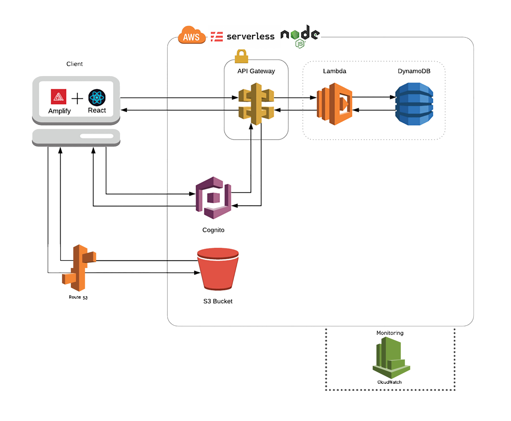
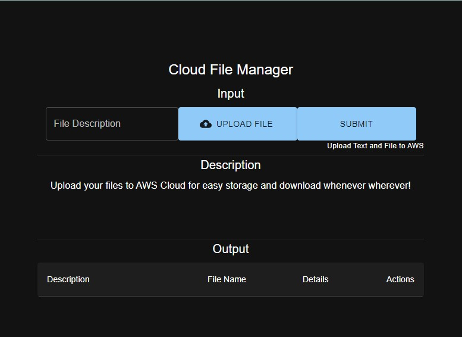
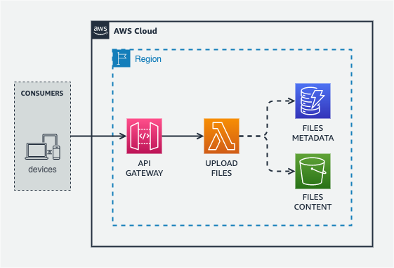
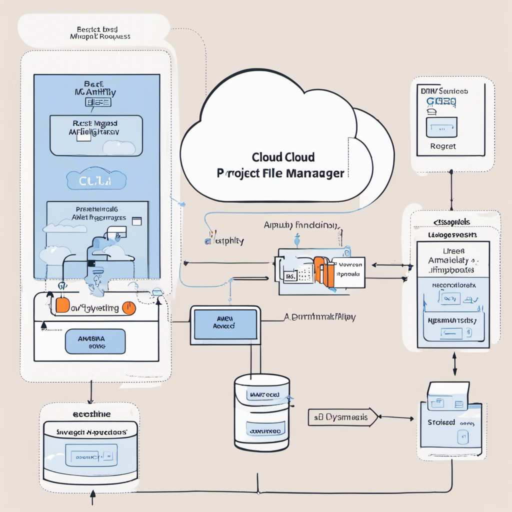
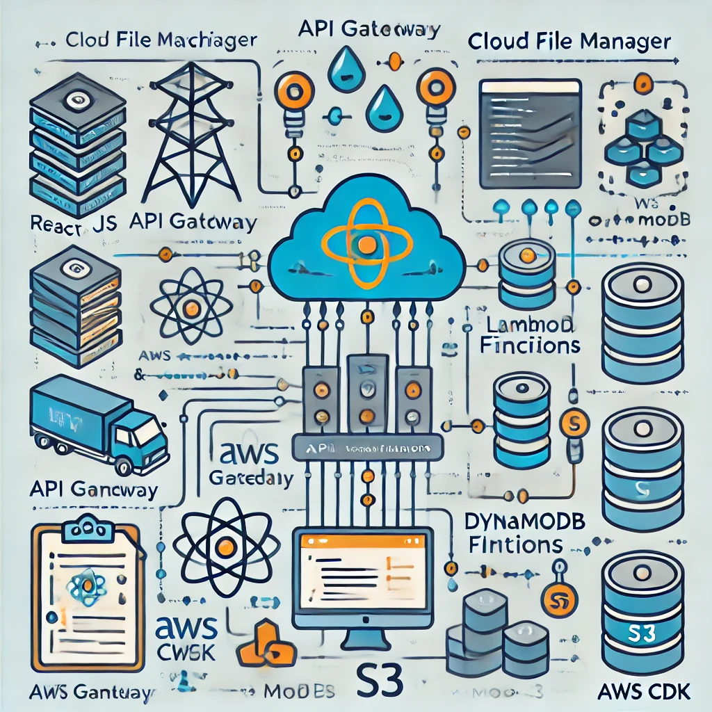

# Cloud File Manager

A full-stack application to manage file uploads and text inputs, with a React frontend hosted on AWS Amplify and a backend comprising API Gateway, Lambda, DynamoDB, and S3, deployed using AWS CDK.

## Project Overview


- **Frontend**: React.js application hosted on AWS Amplify
- **Backend**: 
  - API Gateway to handle HTTP requests
  - Lambda functions to process the requests
  - DynamoDB to store file paths and text inputs
  - S3 to store uploaded files
- **Infrastructure**: Managed using AWS CDK

## Final Application


The application is hosted at: [Cloud File Manager](https://main.dgqjfnss9vm07.amplifyapp.com/)

## Prerequisites

- Node.js and npm installed
- AWS CLI installed and configured
- AWS CDK installed globally (`npm install -g aws-cdk`)
- AWS account with necessary permissions:
  - API Gateway
  - Lambda
  - DynamoDB
  - S3
  - Secrets Manager
  - IAM

## Setup

### Clone Repository
```sh
git clone https://github.com/your-github-username/cloud-file-manager.git
cd cloud-file-manager
```
### Install Dependencies
```sh
# Install frontend dependencies
cd frontend
npm install

# Install backend dependencies
cd ../backend
npm install
```
### Set Environmental Variables
```sh
REACT_APP_QUERY_API=https://your-api-gateway-endpoint/prod/items
REACT_APP_AWS_REGION=your-aws-region
REACT_APP_AWS_ACCESS_KEY_ID=your-access-key-id
REACT_APP_AWS_SECRET_ACCESS_KEY=your-secret-access-key
REACT_APP_BUCKET_NAME=your-bucket-name
```
### Configure AWS CDK
```sh
cd ../backend
cdk bootstrap
cdk deploy
```
### Project Architecture


### Few Images of the Project Architecture developed by AI
#### By PartRock app built on AWS Bedrock

#### By ChatGPT


